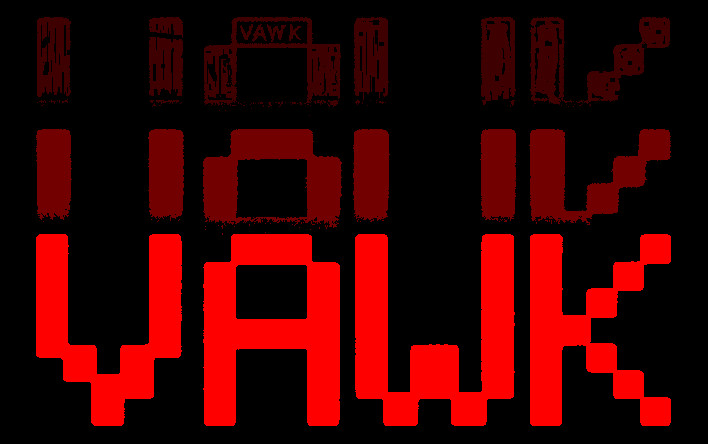

## Still under developing .......

# VAWK

## `TODO` *zh_cn*

> ### 高考后恢复步骤提示
> 重写makefile
> 翻译TUIutils注释

> 1. [x] 将isevent 和 getif 方法封装到EventBase中
> 2. [x] 抽象出事件上游类，实现更自由高性能的事件机制。
> 3. [ ] ```高考```
> 4. [ ] 对照glfw文档，编写窗口类（ VaWindowAbs 纯虚，抽象接口 inc/core/ ）
> 5. [ ] 针对glfw实现VaWindow （ inc/ ）
> 6. [ ] 同理完成输入类
> 7. [ ] other

## `TODO` *en_us*
> 1. [x] Encapsulate isevent and getif methods into EventBase
> 2. [x] Abstracts the upstream classes of events to implement a more flexible and high-performance event mechanism.
> 3. [ ] ```College Entrance Examination```
> 4. [ ] Write a window class (VaWindowAbs pure virtual, abstract interface inc/core/) based on the glfw document
> 5. [ ] Implement VaWindow (in/) for glfw
> 6. [ ] Similarly, complete the input class
> 7. [ ] other


