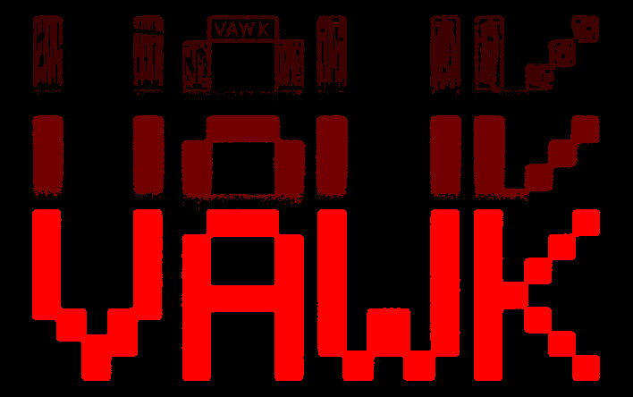

<p align="center">
  <br>
  
  <br>
</p>

<h1 align="center">VAWK</h1>

<p align="center">
  <b>Visual Ansi Widget Kit</b><br>
  <i>面向 Linux 终端的 TUI 工具包</i>
</p>

<p align="center">
  
  
  
  
</p>

---

## 项目结构

```
VAWK/
├── tui-utils/              # TUI 工具库（vaterm + vatui）
│   ├── include/
│   │   ├── vaterm.hpp        — vaterm 统一入口
│   │   ├── vatui.hpp         — Framebuffer（双缓冲、差异渲染）+ VaTui 单例（统一输入）
│   │   └── vaterm/
│   │       ├── enums.hpp     — 枚举定义（颜色、光标、特效）
│   │       ├── color.hpp     — ANSI 颜色控制
│   │       ├── cursor.hpp    — 光标控制
│   │       ├── term.hpp      — 终端管理（terminal 类）
│   │       ├── mouse.hpp     — SGR 鼠标追踪（MouseState、parse、capture）
│   │       ├── system.hpp    — 系统信息
│   │       └── utf.hpp       — UTF-8 处理
│   └── MANUAL_zh.md          — 中文手册（vaterm + vatui）
├── src/
│   └── utils/
│       └── vatui.cpp         — VaTui 实现（需编译为 build/bin.o/vatui.o）
├── include/                # VAWK 核心框架
│   ├── vawk.hpp              — 统一入口
│   └── vawk/
│       ├── event.hpp         — 事件类型系统
│       ├── entity.hpp        — Entity 基类
│       ├── event_upstream.hpp— 事件源
│       ├── event_router.hpp  — 事件路由器
│       ├── input.hpp         — 输入（占位）
│       ├── widget.hpp        — 占位
│       ├── window.hpp        — 占位
│       └── drawable.hpp      — 占位
├── CMakeLists.txt           # TODO: Day 1 创建
├── tests/                   # TODO: Day 2 创建
├── examples/                # TODO: Day 28 创建
├── Makefile
├── README.md
└── LICENSE
```
